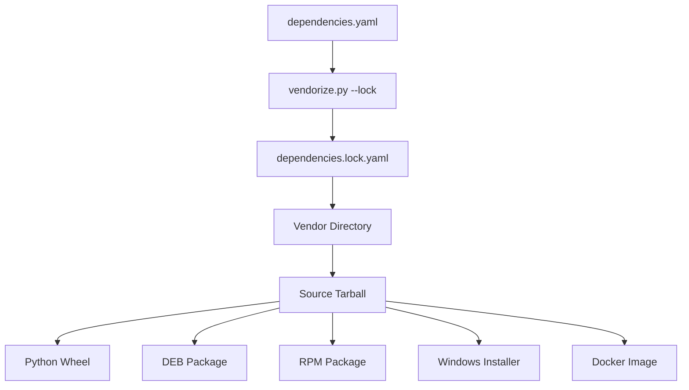

# OpenSPP Packaging Strategy

## Overview

OpenSPP uses a **vendored source tarball** approach for packaging, ensuring reproducible builds across all package formats. This strategy was chosen after careful analysis of the complex dependency landscape that includes:

- Odoo 17.0 framework
- Multiple Git repositories with different branches
- 50+ Python packages with specific versions
- Selective module inclusion from large repositories

## Architecture

### 1. Dependency Management

All dependencies are defined in a single manifest file: `dependencies.yaml`

```yaml
odoo:
  url: "https://github.com/odoo/odoo.git"
  ref: "17.0"  # Branch, tag, or commit SHA

addons:
  openspp_modules:
    url: "https://github.com/OpenSPP/openspp-modules.git"
    ref: "17.0"
    # Include all modules if 'modules' key is omitted
  
  oca_server_tools:
    url: "https://github.com/OCA/server-tools.git"
    ref: "17.0"
    modules:  # Selective inclusion
      - "base_multi_image"
```

### 2. Vendoring Process

The `vendorize.py` script handles dependency resolution:

1. **Lock Phase**: Resolves all refs (branches/tags) to specific commit SHAs
2. **Sync Phase**: Clones repositories at locked commits
3. **Module Selection**: Copies only specified modules or auto-discovers all
4. **Tarball Creation**: Packages everything into a source distribution

```bash
# Create/update lockfile and sync dependencies
python vendorize.py --lock

# Sync from existing lockfile
python vendorize.py --sync

# Create source tarball
python vendorize.py --tarball 17.0.2
```

### 3. Build Process



## Directory Structure

### Source Tarball Layout

```
openspp-17.0.2/
├── odoo/                    # Odoo framework at locked commit
│   ├── addons/
│   ├── odoo/
│   └── ...
├── addons/                  # All external addons
│   ├── openspp_modules/     # OpenSPP's own modules
│   ├── openg2p_registry/    # OpenG2P modules
│   ├── oca_server_tools/    # Selected OCA modules
│   └── ...
├── requirements.txt         # Python dependencies
└── openspp.conf            # Default configuration
```

## Why This Approach?

### Problems Solved

1. **Reproducibility**: Every build uses exact same source code
2. **Network Independence**: Build phase doesn't require network access
3. **Version Atomicity**: Single version number represents entire dependency tree
4. **CI Efficiency**: Slow vendoring happens once, parallel builds are fast
5. **Transparency**: Clear manifest shows all dependencies

### Comparison with Alternatives

| Approach | Pros | Cons |
|----------|------|------|
| **Dynamic Fetch** | Simple to start | Not reproducible, slow CI, network-dependent |
| **Git Submodules** | Git-native | Complex developer workflow, doesn't handle Python deps |
| **Vendored Tarball** | Fully reproducible, fast builds, clear manifest | Requires vendoring script |

## Developer Workflow

### Initial Setup

```bash
git clone https://github.com/OpenSPP/openspp-packaging.git
cd openspp-packaging
pip install PyYAML
python vendorize.py --sync
```

### Updating Dependencies

1. Edit `dependencies.yaml`:
```yaml
addons:
  some_repo:
    ref: "new-branch"  # Update reference
```

2. Update lockfile and test:
```bash
python vendorize.py --lock
# Test your changes locally
```

3. Commit both files:
```bash
git add dependencies.yaml dependencies.lock.yaml
git commit -m "Update some_repo to new-branch"
```

### Adding New Dependencies

1. Add to `dependencies.yaml`:
```yaml
addons:
  new_addon:
    url: "https://github.com/org/repo.git"
    ref: "main"
    modules:  # Optional: specify modules
      - "module1"
      - "module2"
```

2. For Python packages, update `requirements.txt`

3. Run vendoring and test:
```bash
python vendorize.py --lock
```

## CI/CD Pipeline

### GitHub Actions Workflow

1. **Vendor Job**: Creates source tarball from manifest
2. **Build Matrix**: Parallel builds for each package format
3. **Publish**: Upload to GitHub Releases (PyPI/Docker Hub optional)

### Version Management

- **Weekly Builds**: `17.0.YYYYMMDD` (e.g., `17.0.20240115`)
- **Tagged Releases**: Semantic versioning (e.g., `17.0.2`)
- **Manual Builds**: Custom version or timestamp-based

## Best Practices

### 1. Dependency Updates

- Always test locally before pushing
- Update one dependency at a time for easier debugging
- Document why a specific branch/commit is used

### 2. Module Selection

- Be explicit about which modules to include from large repos
- Reduces package size and potential conflicts
- Makes dependencies more transparent

### 3. Version Pinning

- Use tags or commit SHAs for production dependencies
- Branches only for active development
- Document any custom branches or forks

### 4. Lockfile Management

- Always commit lockfile with manifest changes
- Never edit lockfile manually
- Review lockfile diffs carefully in PRs

## Troubleshooting

### Common Issues

**Problem**: Ref not found when vendoring
```bash
Error: Could not resolve ref 'branch-name' in repository
```
**Solution**: Check if branch exists, try with full ref path (refs/heads/branch-name)

**Problem**: Module not found after vendoring
```bash
Module 'xyz' not found in vendor/addons/repo_name/
```
**Solution**: Check if module name is correct in dependencies.yaml

**Problem**: Large source tarball size
**Solution**: Use selective module inclusion instead of vendoring entire repos

### Debug Commands

```bash
# Verbose vendoring
python vendorize.py --lock --verbose

# Check vendored modules
find vendor/addons -name "__manifest__.py" | wc -l

# Verify lockfile
cat dependencies.lock.yaml | grep commit

# Test source tarball
python vendorize.py --tarball test-build
tar -tzf openspp-test-build-source.tar.gz | head -20
```

## Migration from Old Approach

If migrating from the previous fetch-modules.sh approach:

1. Map repos.yaml entries to dependencies.yaml format
2. Convert addons.yaml module lists to 'modules' arrays
3. Run initial vendoring to verify all modules are included
4. Update CI/CD workflows to use new build-packages.yml
5. Test complete build pipeline before removing old scripts

## Future Improvements

Potential enhancements to consider:

1. **Dependency Caching**: Cache vendored dependencies by lockfile hash
2. **Parallel Cloning**: Speed up vendoring with concurrent git operations
3. **Shallow Clone Optimization**: Reduce bandwidth with shallow clones
4. **Module Discovery**: Auto-detect changed modules between versions
5. **Dependency Graph**: Visualize module dependencies
6. **Security Scanning**: Integrate dependency vulnerability checking

## References

- [Odoo Packaging](https://github.com/odoo/odoo/tree/17.0/setup)
- [OCA Tools](https://github.com/OCA/maintainer-tools)
- [Python Packaging Guide](https://packaging.python.org/)
- [FPM Documentation](https://github.com/jordansissel/fpm)